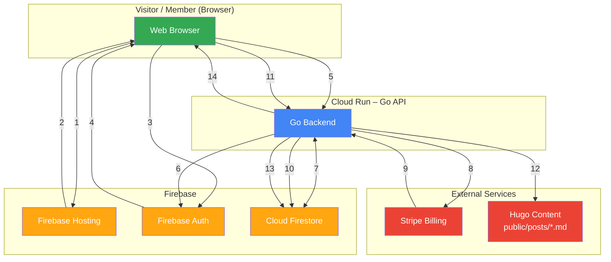
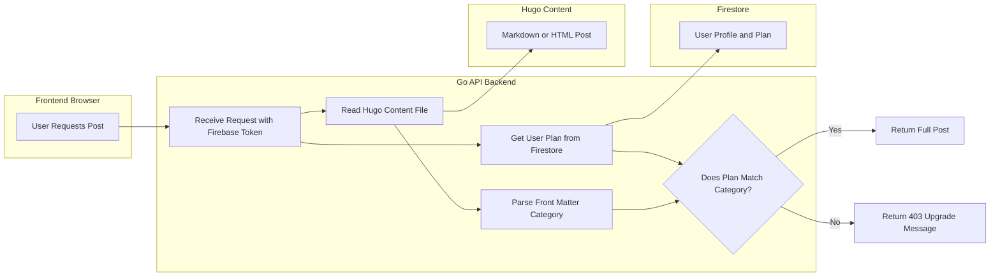

+++
date = '2025-11-28T19:43:49+01:00'
draft = false
title = 'Components'
section = 'diagrams'
weight = 520
+++

## System Components Overview

- **1**. Browser loads static site from Firebase Hosting
- **2**. Hosting serves HTML + JS + public posts
- **3**. User logs in / registers using Firebase Auth (client SDK)
- **4**. Firebase Auth returns ID token to browser
- **5**. Frontend calls any Go API endpoint with Authorization: Bearer <id-token>
- **6**. Go API verifies token using Firebase Admin SDK
- **7**. Go API reads/writes user profile, plan, Stripe IDs in Firestore
- **8**. Go API creates Checkout Session or Billing Portal session in Stripe
- **9**. Stripe sends webhooks (invoice.paid, subscription.deleted, etc.) to Go API
- **10**. Go API updates subscription status and plan in Firestore
- **11**. User requests a protected post (e.g. /post/premium-article)
- **12**. Go API reads the Markdown/HTML file and parses front-matter category
- **13**. Go API checks user’s current plan against post category
- **14**. Go API returns full post (200) or 403 upgrade message

## Protected Content (Posts)

