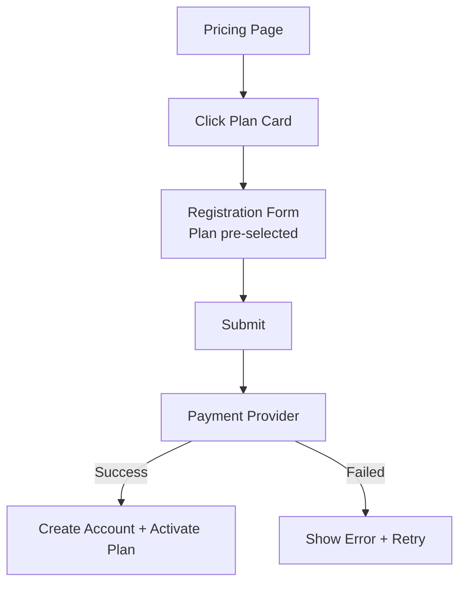
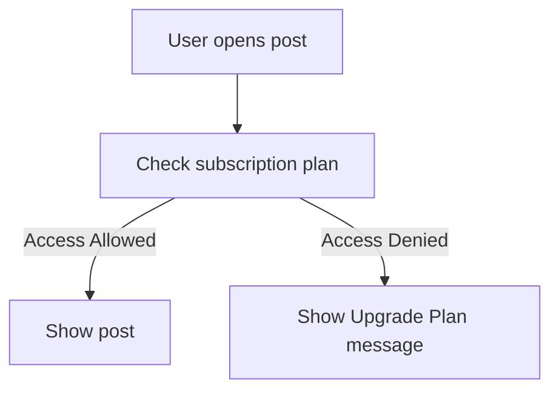
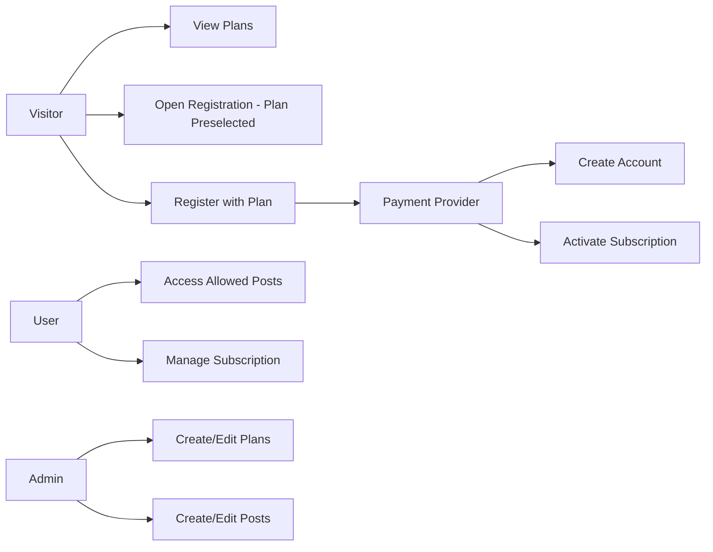

+++
date = '2025-11-27T20:16:24+01:00'
draft = false
title = 'SRS'
section = 'diagrams'
weight = 510
+++

### Registration + Payment Flow (Textual)

### Content Access Flow

---

## Use Case Diagram

