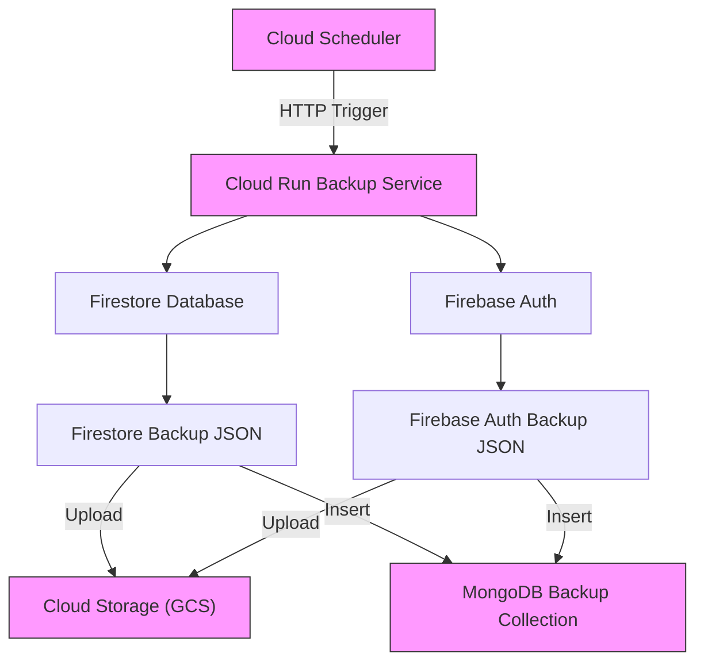

# Backup

## Code Backup

The code is backed up by using redundancy remote repositories: GitHub, GitLab and BitBucket.

## Firestore Backup

In order to avoid vendor lock on the Firestore database, a backup strategy has to be in place. The average database size is like this:

* ~200 users × 10 fields
* ~200 posts × 5 fields
* Total documents: **~400**
* Total data size: **kilobytes, not megabytes**

At this scale, incremental backups are overkill because they add complexity without benefit. The best strategy for the above dataset is daily **full JSON snapshots**. This gives:

* Maximum reliability
* Zero restore ambiguity
* Zero sync bugs
* Minimal cost
* Extremely simple tooling

---

### Why incremental backups are a bad idea *here*

| Factor             | Your scale | Incremental worth it?     |
| ------------------ | ---------- | ------------------------- |
| Dataset size       | Tiny       |  No                      |
| Change volume      | Low        |  No                      |
| Cost pressure      | None       |  No                      |
| Restore simplicity | Important  |  Incrementals complicate |
| Risk tolerance     | Low        |  Avoid                   |

Incrementals shine at **millions of documents**, not hundreds.

---

# Recommended Architecture

```
Firestore
   ↓ (daily pull)
Cloud Run Job (Go)
   ↓
Full JSON snapshot
   ↓
MongoDB (immutable backups)
   ↓
Object Storage (cold archive)
```

---

### Schedule

#### Daily

* **Full snapshot**
* Retain 30–90 days

#### Optional

* Weekly snapshot marked as `long_term`
* Retain 6–12 months

---

### Snapshot structure (simple & portable)

```json
{
  "backup_id": "2026-01-09T00:00:00Z",
  "version": 1,
  "collections": {
    "users": [
      { "id": "u1", "...": "..." }
    ],
    "posts": [
      { "id": "p1", "...": "..." }
    ]
  },
  "stats": {
    "users": 198,
    "posts": 203
  }
}
```

- Human-readable
- One-file restore
- No dependency chain

---

### MongoDB storage model

One document per snapshot:

```json
{
  "_id": "2026-01-09",
  "data": { ... },
  "created_at": ISODate("2026-01-09T00:00:00Z"),
  "checksum": "sha256"
}
```

Or:

* One collection per snapshot date
* Or JSON file per snapshot (even simpler)

---

### Restore process (minutes)

* Pick snapshot
* Import JSON
* Restore to:

  * Firestore
  * MongoDB
  * Any DB

No replay.
No ordering issues.
No partial restores.

---

### Cost impact (negligible)

Rough estimate:

* 400 docs × ~1 KB ≈ **400 KB/day**
* 365 days ≈ **~150 MB/year**
* Storage cost ≈ **pennies per year**

MongoDB + object storage costs will be **noise**.

---

### Extra safety (optional but recommended)

* SHA-256 checksum per snapshot
* Immutable object storage (WORM)
* Store one copy **outside GCP**
* Periodic restore test (quarterly)

---

# What NOT to do

- Incremental snapshots
- Event-based replication
- Real-time sync
- Partial backups
- Complex retention logic

---

# Final Recommendation (Short)

**Daily full JSON snapshot. Period.**

* Simple
* Safe
* Portable
* Cheap
* Zero lock-in

Incrementals would *reduce reliability* for your use case.

---

If you want, I can:

* Write the **Go Cloud Run Job**
* Provide **MongoDB schema**
* Create **restore scripts**
* Design **off-cloud archival**

Just tell me what you want next 👌

* * *

## Firebase Authenication Backup

Backing up Firebase Authentication is a bit different from Firestore because Auth is not a standard database. It stores users, passwords (hashed), and linked identity providers. You can still back it up safely, and it’s a good practice if you want **off-platform disaster recovery**.

### What Firebase Auth stores

* User IDs (`uid`)
* Emails / phone numbers
* Password hashes (you **cannot see plaintext**)
* Display names, photo URLs
* Email verified flags
* Provider info (Google, Facebook, Apple, etc.)
* Metadata: creation date, last sign-in
* Custom claims (roles, flags)

> Basically all user identity data except plaintext passwords.

### Backup options

#### **Option A: Firebase Admin SDK export**

You can use the **Admin SDK** to export all users programmatically.

```go
package main

import (
    "context"
    "encoding/json"
    "fmt"
    "log"

    firebase "firebase.google.com/go/v4"
    "firebase.google.com/go/v4/auth"
    "google.golang.org/api/option"
)

func main() {
    ctx := context.Background()

    // Initialize Firebase App with default credentials
    app, err := firebase.NewApp(ctx, nil, option.WithCredentialsFile("path/to/serviceAccountKey.json"))
    if err != nil {
        log.Fatalf("error initializing app: %v", err)
    }

    client, err := app.Auth(ctx)
    if err != nil {
        log.Fatalf("error getting Auth client: %v", err)
    }

    var users []map[string]interface{}
    pageToken := ""
    for {
        // List up to 1000 users per page
        result, err := client.ListUsers(ctx, pageToken)
        if err != nil {
            log.Fatalf("error listing users: %v", err)
        }

        for _, u := range result.Users {
            users = append(users, u.ToJSON())
        }

        if result.PageToken == "" {
            break
        }
        pageToken = result.PageToken
    }

    // Convert to JSON and print
    data, err := json.MarshalIndent(users, "", "  ")
    if err != nil {
        log.Fatalf("error marshaling users to JSON: %v", err)
    }

    fmt.Println(string(data))
}
```

* You get **all user records in JSON**.
* Can be stored in **MongoDB, GCS, or any object storage**.
* Includes **password hashes**, so you can restore to another Firebase project.

#### **Option B: Use `gcloud` command (CLI)**

Firebase Auth is part of the **Identity Platform**, so you can use:

```bash
gcloud identity users export --project YOUR_PROJECT_ID --output-file=users.json
```

* Gives you a **JSON file with user data**.
* Supports exporting custom claims.

#### **Option C: Periodic export via Cloud Run / Scheduler**

* Similar to Firestore backup:

  1. Cloud Run job lists users via Admin SDK
  2. Dumps JSON to **MongoDB or GCS**
  3. Optional: schedule with **Cloud Scheduler** (daily/weekly)

This gives you **incremental or full snapshot options**.

---

### Restore options

* You can **import JSON back into Firebase Auth**:

```javascript
await admin.auth().importUsers(usersArray, {
  hash: {
    algorithm: "BCRYPT",
  },
});
```

* Only **password-hash-compatible algorithms** work.
* You **cannot restore plaintext passwords**, but hash restore works fine.

> So backup + restore is fully possible off-platform.

---

### Best practices

* **JSON-level backup**: keep it in MongoDB or GCS (encrypted)
* **Encrypt** backups because they include password hashes
* **Version your backups** (timestamped)
* **Separate from Firestore backup**, but you can trigger both from same Cloud Run job

---

### TL;DR

| Aspect          | Firestore             | Firebase Auth                    |
| --------------- | --------------------- | -------------------------------- |
| Data type       | Documents             | User records                     |
| Backup          | JSON dump             | JSON dump via Admin SDK / gcloud |
| Incremental     | Optional, mostly full | Usually full (small dataset)     |
| Restore         | Write to DB / MongoDB | importUsers() with hash          |
| Security        | Encrypt storage       | Must encrypt (password hashes)   |
| Off-platform DR | Easy                  | Fully supported                  |

---

💡 **In your case**:

* ~200 users
* ~200 posts
* Backup **all users JSON** daily/weekly → MongoDB
* Backup Firestore separately
* Both JSON files can be stored in **GCS / S3**
* No need for incremental backups at this scale

---

## Full backup implementation

**Cloud Scheduler + Cloud Run + Go code** for backing up both **Firestore** and **Firebase Auth**.

1. Go code (ready for Cloud Run)
2. Instructions for deploying to Cloud Run
3. Cloud Scheduler setup
4. Optional notes for storage in GCS/MongoDB

---

### Code

#### Go Code (backup.go)

This Go program:

* Backs up Firestore collections (`users` and `posts`)
* Backs up Firebase Auth users
* Saves JSON files locally (can be extended to GCS/MongoDB)

```go
package main

import (
    "context"
    "encoding/json"
    "fmt"
    "log"
    "net/http"
    "os"
    "time"

    firebase "firebase.google.com/go/v4"
    "firebase.google.com/go/v4/auth"
    "cloud.google.com/go/firestore"
    "google.golang.org/api/option"
)

func backupHandler(w http.ResponseWriter, r *http.Request) {
    ctx := context.Background()
    timestamp := time.Now().Format("2006-01-02T15-04-05")

    // Initialize Firebase App
    app, err := firebase.NewApp(ctx, nil, option.WithCredentialsFile("serviceAccountKey.json"))
    if err != nil {
        log.Fatalf("error initializing app: %v", err)
    }

    // Firestore client
    fsClient, err := app.Firestore(ctx)
    if err != nil {
        log.Fatalf("error initializing Firestore client: %v", err)
    }
    defer fsClient.Close()

    // Auth client
    authClient, err := app.Auth(ctx)
    if err != nil {
        log.Fatalf("error initializing Auth client: %v", err)
    }

    // ---------------------------
    // 1️⃣ Backup Firestore
    // ---------------------------
    collections := []string{"users", "posts"}
    firestoreBackup := make(map[string][]map[string]interface{})

    for _, col := range collections {
        docsIter := fsClient.Collection(col).Documents(ctx)
        var colData []map[string]interface{}
        for {
            doc, err := docsIter.Next()
            if err != nil {
                break
            }
            colData = append(colData, doc.Data())
        }
        firestoreBackup[col] = colData
    }

    fsFile := fmt.Sprintf("/tmp/firestore_backup_%s.json", timestamp)
    fsData, _ := json.MarshalIndent(firestoreBackup, "", "  ")
    os.WriteFile(fsFile, fsData, 0644)
    fmt.Println("Firestore backup saved to:", fsFile)

    // ---------------------------
    // 2️⃣ Backup Firebase Auth
    // ---------------------------
    var authUsers []map[string]interface{}
    pageToken := ""
    for {
        result, err := authClient.ListUsers(ctx, pageToken)
        if err != nil {
            log.Fatalf("error listing users: %v", err)
        }

        for _, u := range result.Users {
            authUsers = append(authUsers, u.ToJSON())
        }

        if result.PageToken == "" {
            break
        }
        pageToken = result.PageToken
    }

    authFile := fmt.Sprintf("/tmp/firebase_auth_backup_%s.json", timestamp)
    authData, _ := json.MarshalIndent(authUsers, "", "  ")
    os.WriteFile(authFile, authData, 0644)
    fmt.Println("Firebase Auth backup saved to:", authFile)

    // ---------------------------
    // 3️⃣ Optional: Upload to GCS or MongoDB
    // ---------------------------
    // Add your code to push fsFile and authFile to cloud storage or MongoDB

    fmt.Fprintln(w, "Backup completed successfully!")
}

func main() {
    http.HandleFunc("/", backupHandler)
    port := os.Getenv("PORT")
    if port == "" {
        port = "8080"
    }
    log.Printf("Starting server on port %s...", port)
    log.Fatal(http.ListenAndServe(":"+port, nil))
}
```

#### Dockerfile (for Cloud Run)

```dockerfile
# Use official Go image
FROM golang:1.21-alpine AS build

WORKDIR /app
COPY go.mod go.sum ./
RUN go mod download
COPY . .

RUN go build -o backup .

# Use lightweight image for runtime
FROM alpine:latest
WORKDIR /app
COPY --from=build /app/backup .
COPY serviceAccountKey.json .   # Make sure it's secure!
EXPOSE 8080

CMD ["./backup"]
```

#### Deploy to Cloud Run

```bash
# Build container
gcloud builds submit --tag gcr.io/YOUR_PROJECT_ID/firestore-auth-backup

# Deploy Cloud Run service
gcloud run deploy firestore-auth-backup \
    --image gcr.io/YOUR_PROJECT_ID/firestore-auth-backup \
    --platform managed \
    --region YOUR_REGION \
    --allow-unauthenticated
```

> Optional: remove `--allow-unauthenticated` and secure with **Cloud Scheduler OIDC token**.

#### Cloud Scheduler Setup

```bash
gcloud scheduler jobs create http backup-job \
    --schedule="0 2 * * *" \
    --uri="https://YOUR_CLOUD_RUN_URL" \
    --http-method=GET \
    --time-zone="UTC" \
    --oidc-service-account="YOUR_SCHEDULER_SA@YOUR_PROJECT.iam.gserviceaccount.com"
```

* Runs **daily at 02:00 UTC**
* Uses **OIDC authentication** to securely call Cloud Run
* Triggers your Go backup program automatically

#### Optional: Upload to GCS / MongoDB

* Use `cloud.google.com/go/storage` to upload `/tmp/firestore_backup_*.json` and `/tmp/firebase_auth_backup_*.json` to a **GCS bucket**.
* Or use MongoDB driver to save JSON for **off-platform backup**.

> Tip: Always encrypt backups at rest.

With this setup:

* You have **automatic daily backups** of Firestore + Firebase Auth
* Backups are in JSON for **off-platform disaster recovery**
* Cloud Run + Scheduler handles serverless automation

---

### Diagram



### Flow explanation

1. **Cloud Scheduler**

   * Sends an HTTP request to Cloud Run at a fixed schedule (daily/weekly)
   * Can authenticate via **OIDC service account**

2. **Cloud Run Backup Service**

   * Runs your **Go program**
   * Exports Firestore collections and Firebase Auth users as JSON

3. **JSON Backups**

   * Firestore → `firestore_backup_TIMESTAMP.json`
   * Firebase Auth → `firebase_auth_backup_TIMESTAMP.json`

4. **Optional storage**

   * **GCS**: long-term cold storage, cross-cloud recovery
   * **MongoDB**: off-platform DR, can restore JSON easily


