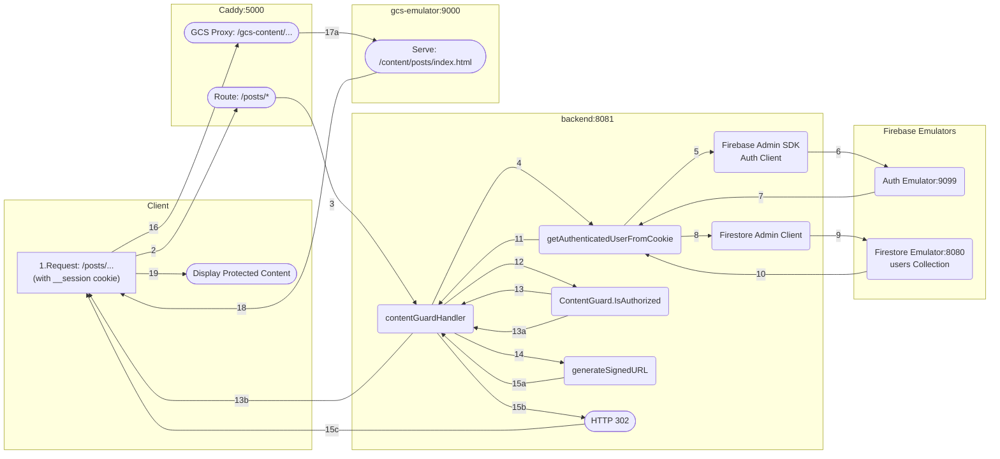

Users could to access posts ONLY if their plan matches the category specified in the front-matter of the markdown file.

Implementation of a gated content microservice pattern in the local development environment:

- Authentication: Firebase Auth handles session management.
- Authorization: The Go backend validates the session cookie and performs the content access check against the user's plan.
- Secure Content Delivery: The Go backend generates a time-limited, signed URL for the protected file.
- Local Emulation: The Caddy reverse proxy acts as the necessary intermediary to route the signed URL request back to the GCS Emulator, making the local process behave exactly like a production environment.

### Workflow Diagram



### Process Steps

1.  **Request Initiation:** The user's browser requests the protected URL (e.g., `/posts/`), automatically including the `__session` cookie.
2.  **Caddy Routes Request:** The Caddy reverse proxy receives the request and proxies it to the Go Backend (`backend:8081`).
3.  **To Go Backend:** The request is passed to the Go Backend's `contentGuardHandler`.
4.  **Read Session Cookie:** The handler calls the `getAuthenticatedUserFromCookie` helper function.
5.  **Verify Token:** The helper function passes the cookie to the Firebase Admin SDK's Auth Client for verification.
6.  **Request Verification:** The Auth Client contacts the **Auth Emulator** (`:9099`).
7.  **Returns UID:** The Auth Emulator validates the token and returns the User ID (UID).
8.  **Fetch User Plan:** The helper uses the UID to query the `firestoreClient`.
9.  **Query users Collection:** The Firestore Client makes an API call to the **Firestore Emulator** (`:8080`).
10. **Returns Plan Data:** The Firestore Emulator returns the user's plan (e.g., 'basic', 'pro') to the helper function.
11. **Returns AuthUser:** The helper returns the full authenticated user profile (`AuthUser`) to the handler.
12. **Check Authorization:** The handler calls `contentGuard.IsAuthorized(requestPath, userPlan)`. The Guard checks the requested path against its cached plan map (ContentGuard.permissions).
13. **Authorization Outcome:**
      * **13a. Plan DENIED:** If the plan is insufficient, the check fails.
      * **13b. HTTP 403 Forbidden:** The handler returns an HTTP 403 Forbidden response to the client.
      * **13. Plan Authorized:** If the check passes, the process continues.
14. **Generate Fake Signed URL:** The handler calls the `generateSignedURL` function.
15. **Redirection Preparation:**
      * **15a. Returns Signed URL:** The `generateSignedURL` function returns the URL string containing the GCS proxy prefix (`/gcs-content/...`) and the signed parameters.
      * **15b. Execute Redirect:** The handler sets the `Location` header to the signed URL.
      * **15c. HTTP 302:** The Go Backend sends the `HTTP 302 Found` response to the client.
16. **Follow Signed URL:** The browser follows the redirect, making a new request to the signed URL (now hitting the Caddy proxy).
17. **Caddy GCS Proxy:**
      * **17a. Strip /gcs-content & Proxy:** Caddy intercepts the request, strips the `/gcs-content` prefix, and proxies the modified request to the **GCS Emulator** (`gcs-emulator:9000`).
18. **HTTP 200 Content:** The GCS Emulator validates the signature parameters and serves the content (e.g., `posts/index.html`) back to Caddy.
19. **Display Protected Content:** Caddy forwards the HTTP 200 response to the browser, which renders the protected page.


### Permissions Map

Restricted content can be accessed only if this condition is true: User's `plan` matches the post's front-matter `categories`.

As we saw in step 12 of the process above, the guard checks the requested path against its cached plan map. This map is the `permissions` map.

The permissions map is generated once:

```go
type ContentGuard struct {
	permissions map[string][]string
	mu          sync.RWMutex
}

// Global variable contentGuard initializes an empty permissions map
var contentGuard = ContentGuard{permissions: make(map[string][]string)}

// This function populates the permissions map
func (cg *ContentGuard) Init() {
    // ...
}
```

If a new post is added, the permissions map is not updated. In order to update the permissions map everytime a new post is added, we need to change the way GitHub Actions builds the Hugo site. For information about building, check [Deploy](../deploy/).

## Where Go API gets content/posts/

Go API has to create a permissions map. It has to walk content/posts/. In my development environment, that directory is in frontend/content/posts/. But in production, the directory is in GitHub, right? So, how Go API generate the permissions map? 

This is a crucial architecture question that requires you to differentiate between the **build phase** and the **runtime phase** of your application.

Since the Go API is responsible for the content guard, it must know the access rules at runtime. Because your source files (`.md` files) are not available to the Go service in production (they are only in your Git repository), you cannot walk the `content/posts/` directory at runtime in the Cloud Run service.

The solution is to **decouple the static content from the runtime configuration** by introducing an intermediate step during your build process.

Here is the correct workflow for both development and production:

### 1\. Development Environment Workflow

In your development environment, the Go API can read the files directly, which is why your current setup works:

1.  **Go API Startup (`main.go`):** The Go binary runs inside the `backend` container.
2.  **Mapping Directory:** The `main.go` file defines `ContentRoot = "../frontend/content/posts"`.
3.  **Local Read:** The Go program is able to traverse its local filesystem, go up one directory, and find the posts directory to read the Markdown front matter (where the access plan is specified).
4.  **Result:** The Go API builds the in-memory permissions map.

### 2\. Production (Cloud Run) Workflow

In production, the Go container is isolated. It only contains the compiled Go binary and its dependencies. It does not have access to your Hugo source files.

The Go API must be updated to read the permissions map from a file or a database that is packaged with the container.

#### **Solution: Generate a Configuration File During the Build**

The best practice is to generate a dedicated JSON or TOML configuration file that holds the permissions map and package it with the Go service container.

#### **Step A: Introduce a Build Step (Hugo Build)**

You need a script or a Hugo build step to scan the `content/posts/` directory and extract the access plan from the front matter of every Markdown file.

**Example Script Logic (Conceptual)**:

```bash
#!/bin/bash
# Script to run during your CI/CD build before the Go Container is built

# 1. Initialize empty JSON config
echo '{"permissions": {}}' > permissions.json

# 2. Iterate over all posts
for file in frontend/content/posts/*.md; do
  # Extract the path used by the Go API (e.g., /posts/week0001)
  POST_PATH=$(basename "$file" .md | sed 's/index//') # Generates /posts/week0001
  
  # Extract the 'plan' requirement from the front matter (e.g., requires: [basic, pro])
  REQUIRED_PLANS=$(grep -E '^requires:' "$file" | cut -d '[' -f2 | cut -d ']' -f1 | tr -d ' ')
  
  # Append to JSON config
  # (Actual JSON manipulation is more complex, but this is the concept)
  # Permissions['/posts/week0001'] = ['basic', 'pro']
done

# 3. Save permissions.json
```

#### **Step B: Package the Config File**

In your `backend/Containerfile` (the Dockerfile for your Go API), you must now copy this generated `permissions.json` file into the final image:

```dockerfile
# backend/Containerfile
# ... (building and compiling Go binary)

# Stage 2: Final image
FROM alpine:latest
# ...
WORKDIR /app
COPY --from=builder /path/to/go/binary /app/go-server

# COPY THE GENERATED CONFIG FILE INTO THE IMAGE
# This file was generated in your CI/CD pipeline and placed here.
COPY permissions.json /app/permissions.json 

CMD ["/app/go-server", "--config=/app/permissions.json"]
```

#### **Step C: Update `backend/main.go` (Go Runtime)**

Your Go application will change from walking the local filesystem to loading the config file it finds packaged inside its own container:

```go
// backend/main.go

// CHANGE 1: New path constant for the config file inside the container
const PermissionsConfigPath = "/app/permissions.json" 

// CHANGE 2: Update the ContentGuard initialization logic
func main() {
    // ... setup Firebase/Firestore/GCS clients ...

    if os.Getenv("ENV") == "production" {
        // PRODUCTION: Load map from the packaged JSON file
        err := contentGuard.LoadFromFile(PermissionsConfigPath)
        if err != nil {
            log.Fatalf("Failed to load permissions config: %v", err)
        }
    } else {
        // DEVELOPMENT: Use old logic to walk local filesystem
        err := contentGuard.WalkLocalContent(ContentRoot)
        if err != nil {
            log.Fatalf("Failed to walk local content: %v", err)
        }
    }

    log.Printf("Initializing Content Guard... %d paths loaded.", len(contentGuard.permissions))
    // ... start server ...
}

// NOTE: You will need to implement the LoadFromFile and WalkLocalContent methods
// in your ContentGuard struct.
```

By decoupling the file discovery (which happens during the CI/CD build) from the permission enforcement (which happens during Cloud Run runtime), you ensure the Go API is always using the correct access rules without needing to access your source code repository.

* * *

The process after clicking on "Posts" is working correctly. The logs show that your application successfully implemented the gated content mechanism using a signed URL flow.

Here is a breakdown of the steps confirmed by the logs:

1.  **Initial Request and Authorization:**
    * The browser makes a `GET` request to `/posts/`.
    * The Caddy server routes this request to the Go backend (`backend:8081`).
    * The Go backend processes the request and, because you are logged in (indicated by the session cookie), the authorization check passes: `User authorized.`.

2.  **Signed URL Generation:**
    * The Go backend, running in emulator mode, generates a temporary, signed URL for the protected file: `posts/index.html`.
    * The path includes the prefix `/gcs-content/` (e.g., `http://localhost:5000/gcs-content/content/posts/index.html?...`).

3.  **Redirection:**
    * The Go backend instructs Caddy to send a `302 Found` redirect to the browser, pointing to the newly generated signed URL.

4.  **Content Retrieval:**
    * The browser follows the redirect to the signed URL.
    * Caddy's `@gcs_proxy` handler intercepts the `/gcs-content/...` request.
    * Caddy strips the `/gcs-content` prefix and proxies the request to the GCS emulator (`gcs-emulator:9000`).
    * The GCS emulator serves the requested file (`posts/index.html`) successfully, and the browser receives the content with a `200 OK` status code and a `content-length` of 4243 bytes.

This confirms that the successful registration and subsequent access to the protected content are both functioning as designed.

##### Summary

- Go Backend: Generates the correct path: /gcs-content/content/posts/index.html.
- Caddy (path stripping): Strips /gcs-content/, leaving /content/posts/index.html.
- Caddy (syntax correction): The caddy-server logs show the Caddyfile successfully loaded, meaning the header_up syntax is now correct.
- GCS Emulator Received Path: The emulator logs show it received the request for /content/posts/index.html (the correct path).
- The Core Conflict: The GCS emulator is still returning a 404 for the proxied request that includes the signed URL parameters, even though it serves the same unauthenticated path via a direct curl (curl -I http://localhost:9000/content/posts/index.html returns 200 OK).
