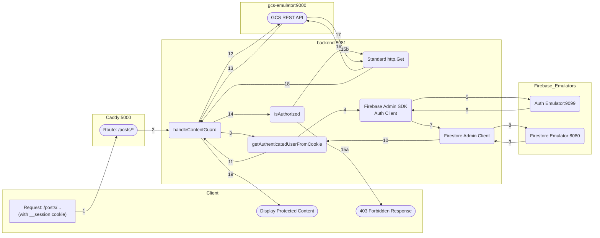
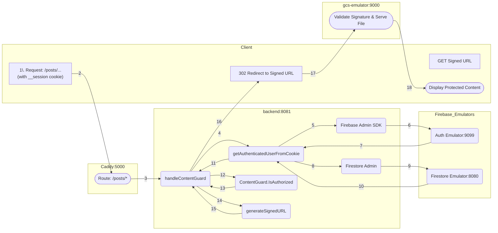

# Gated Content

## Introduction

Users can access posts ONLY if their plan matches the category specified in the front-matter of the markdown file of the post.

The Gated Content pattern securely delivers restricted files (like premium posts or documents) by strictly enforcing user authentication and authorization.

The entire workflow, from the initial user request to the final content display, is handled across four primary services: the Client (Browser), Caddy router (emulating Firebase Hosting), Go Backend (API), and the GCS Emulator.

Due to Firebase Hosting being the router, the most secure way to deliver the restricted content to the client is using one of these two methods:

1. Streaming the file directly from the Go Backend.
2. Generating a short time-limited **Signed URL** for content delivery.

On both cases, restricted pages (files) are stored in GCS (Google Cloud Storage).

* * *

## Scenario 1: Direct Streaming via SDK

In this scenario, the Go backend reads the file directly from GCS using the SDK and streams it to the user. This is the fastest and most secure method for small files and low traffic (<1MB files and <5000 visits day).

Direct Streaming via SDK: the wording reflects that the backend is no longer just a gatekeeper but the actual delivery vehicle for the content. Instead of delegating the final fetch to the client and storage provider, the backend takes full ownership of the data stream.

#### 1. Delegation of Responsibility

This architecture improves security and efficiency by clearly separating concerns across components:

| Component | Primary Responsibility | Key Feature |
| :--- | :--- | :--- |
| **Go Backend** | Authentication, Authz & Proxying | Verifies sessions via Firebase, evaluates the plan hierarchy, and streams gated content from GCS. |
| **Caddy Proxy** | Unified Entry Point | Forwards external requests to the Go Backend while ensuring a single-domain experience for the user. |
| **GCS Emulator** | Gated Metadata & Storage | Stores raw HTML posts and custom `required-plans` metadata, accessible only by internal backend requests. |
| **Firebase Emulators** | Identity & Profile Provider | Handles session validation (Auth) and stores user subscription levels (Firestore) for real-time lookups. |

#### 2. Pattern Implementation

Implementation of a gated content microservice pattern in the local development environment:

- **Authentication**: Firebase Auth manages secure session state via `__session` cookies. The Go backend leverages the Firebase Admin SDK to verify these tokens against the local Auth Emulator.
- **Authorization & Metadata**: The Go backend performs a real-time dual-check:
    1. It fetches the user's `plan` from Firestore.
    2. It fetches the object's `required-plans` from GCS metadata.
    3. It evaluates access using a defined hierarchy (`visitor` < `basic` < `pro` < `elite`).
- **Secure Content Delivery**: Content is never served directly from the public web. The Go backend acts as a **Secure Proxy**, initiating an internal REST request to GCS and streaming the binary data using `io.Copy`. This ensures GCS credentials and URLs are never exposed to the client.
- **Local Emulation Strategy**:
    - **Go Backend as Proxy**: Bypasses complex cloud signing logic by using a direct REST API call (`alt=media`) to the GCS emulator to retrieve raw file bytes.
    - **Metadata-Driven Guard**: Uses GCS custom metadata fields to store access rules, allowing content to be "gated" simply by tagging the file during the upload process (e.g., via the `uploader.go` script).

#### 2. Server Configuration

#### `Caddyfile` (for dev)

Simplify the backend block. Since Go is now streaming the file, Caddy does not need to intercept any response headers.

```caddy
    @backend path /api/* /posts/*
    handle @backend {
        reverse_proxy backend:8081
    }

```

#### `firebase.json` (for prod)

Ensure the rewrite rules point to the backend for the `/posts/` path.

```json
    "rewrites": [
      { "source": "/api/**", "destination": "http://backend:8081/api/**" },
      { "source": "/posts/**", "destination": "http://backend:8081/posts/**" },
      { "source": "**", "destination": "/index.html" }
    ]
```

#### 3. Diagram Workflow



#### 4. Process Steps

1.  **Request Initiation**: The browser requests a protected URL (e.g., `/posts/week0005/`), automatically sending the `__session` cookie.
2.  **Caddy Routing**: The Caddy proxy forwards the request to the Go Backend's `handleContentGuard` handler on port `:8081`.
3.  **Authentication Start**: The handler calls `getAuthenticatedUserFromCookie` to identify the requester and their plan.
4.  **SDK Invocation**: The helper uses the Firebase Admin SDK `authClient` to begin the verification process.
5.  **Token Verification**: The SDK sends the session cookie to the **Auth Emulator (:9099)** to validate the token.
6.  **UID Retrieval**: The Auth Emulator validates the session and returns the unique User ID (UID) and claims.
7.  **Database Request**: The helper then uses the **Firestore Admin Client** to look up the user's profile.
8.  **Profile Lookup**: The client queries the **Firestore Emulator (:8080)** using the verified UID.
9.  **Plan Retrieval**: The Firestore Emulator returns the user's document containing their subscription level (e.g., `pro`).
10. **Helper Completion**: The Firestore client returns the retrieved plan data back to the `getAuthenticatedUserFromCookie` function.
11. **Return User Profile**: The helper returns the full `AuthUser` profile (UID, Email, Plan) back to the `handleContentGuard` handler.
12. **Metadata Fetch**: The handler calls `getRequiredPlans`, which performs an `Attrs` request to the **GCS Emulator (:9000)**.
13. **Requirements Retrieval**: The GCS Emulator returns the object's custom metadata, specifically the `required-plans` values.
14. **Authorization Logic**: The handler invokes `isAuthorized` to compare the user's plan level against the object's requirements.
15. **Authorization Outcome**:
    * **15a (Denied)**: If the user fails the check, the handler returns a `403 Forbidden` status and an error page.
    * **15b (Authorized)**: If the user is authorized, the process continues to content retrieval.
16. **Media Request**: The handler initiates a standard `http.Get` request with `alt=media` to the **GCS Emulator**.
17. **Content Delivery**: The GCS Emulator streams the raw HTML binary data of the post back to the backend.
18. **Data Reception**: The Go Backend receives the binary data stream and sets the correct `Content-Type` header.
19. **Direct Stream to Client**: The backend uses `io.Copy` to pipe the HTML bytes directly to the browser response, completing the proxy flow.

---

## Scenario 2: Signed URL Redirect

> [!DANGER]
> The documentation for Scenario 2: Signed URL Redirect is currently in design stage. It can be incorrect.

In this scenario, the Go backend generates a temporary link and instructs the browser to fetch the file directly from GCS via an HTTP 302 redirect.

Signed URL Redirect: the explanation shifts the focus from the backend being a "content provider" to being a "security validator." In this model, the backend issues a temporary "pass" (the Signed URL) and offloads the heavy lifting of data transfer to the storage provider.

#### 1. Delegation of Responsibility

This architecture improves efficiency and scalability by offloading data delivery to specialized storage infrastructure. The backend remains the source of truth for security while the storage layer handles high-volume traffic.

| Component | Primary Responsibility | Key Feature |
| :--- | :--- | :--- |
| **Go Backend** | **Authorization & Key Generation** | Validates user identity and plan; generates a cryptographically signed, short-lived URL as a temporary access token. |
| **Caddy Proxy** | **Transparent Redirection** | (Local) Handles the routing of the signed request back to the emulator, ensuring the client-to-storage handshake mirrors production. |
| **GCS Emulator / GCS** | **Scalable Content Delivery** | Validates the signature and expiration of the URL; serves the actual bytes directly to the client with high throughput. |

Implementation of a Gated Content Microservice Pattern (Signed URL Redirect)

- **Authentication**: Firebase Auth manages the secure user session via the `__session cookie`.
- **Authorization**: The Go backend interceptor validates the session and confirms the user’s plan level (e.g., Basic, Pro, Elite) before granting a "key."
- **Secure Content Delivery**: The Go backend generates a time-limited Signed URL. The user is then redirected (HTTP 302) to this URL, allowing the browser to fetch the content directly from the bucket. This reduces backend CPU/Memory load.
- **Local Emulation**:
    - **Caddy Reverse Proxy**: Acts as a necessary intermediary to bridge the local domain to the GCS Emulator, allowing the browser to follow the redirect as if it were communicating with the public Google Cloud API.
    - **Fake GCS Server**: Validates the manually constructed signature and serves the restricted files from the local data mount.

#### 2. Server Configuration

#### `Caddyfile` (for dev)

Ensure the GCS proxy is active so that when the browser follows the redirect to `/gcs-content/`, Caddy can route it to the emulator.

```caddy
    # Ensure this block exists so browser can reach emulator after redirect
    @gcs_proxy path_regexp gcs_content ^/gcs-content/.*
    handle @gcs_proxy {
        uri strip_prefix /gcs-content
        reverse_proxy gcs-emulator:9000 {
            header_up Host localhost:9000
        }
    }

    @backend path /api/* /posts/*
    handle @backend {
        reverse_proxy backend:8081
    }

```

#### `firebase.json` (for prod)

The configuration remains identical to Scenario 1. Firebase Hosting routes the initial request to Cloud Run, which then sends the redirect response back to the user's browser.

Ensure the rewrite rules point to the backend for the `/posts/` path.

```json
    "rewrites": [
      { "source": "/api/**", "destination": "http://backend:8081/api/**" },
      { "source": "/posts/**", "destination": "http://backend:8081/posts/**" },
      { "source": "**", "destination": "/index.html" }
    ]
```

#### 3. Diagram Workflow



#### 4. Process Steps

1. **Request Initiation**: The browser requests a protected URL (e.g., `/posts/week0003/`), sending the `__session` cookie.
2. **Caddy Routes Request**: The Caddy proxy receives the traffic and forwards it to the Go Backend on port `:8081`.
3. **Handler Invocation**: The Go Backend receives the request in `handleContentGuard`.
4. **Read Session Cookie**: The handler calls `getAuthenticatedUserFromCookie` to identify the user.
5. **Verify Token**: The helper uses the Firebase Admin SDK to verify the session cookie.
6. **Auth Emulator Check**: The Firebase Auth Emulator validates the session.
7. **UID Returned**: The unique User ID is returned to the helper function.
8. **Fetch User Profile**: The helper queries Firestore to retrieve the user's subscription plan.
9. **Firestore Emulator Lookup**: The Firestore Emulator returns the plan level (e.g., `elite`).
10. **Return AuthUser**: The helper returns the full `AuthUser` profile to the handler.
11. **Authorization Check**: The handler invokes contentGuard.IsAuthorized to check if the user's plan permits access to the specific permPath.
12. **Authorization Outcome**:
     - **Denied**: The handler returns a `403 Forbidden` status with an HTML error message.
     - **Authorized**: The process continues to the fetch stage.
13. **Generate Signed URL**: The handler calls `generateSignedURL`.
14. **Signature Creation**: In production, the SDK creates a V4 signature; in emulator mode, it manually constructs a URL pointing to the storage service.
15. **Signed URL Returned**: The short-lived URL (containing the access token) is returned to the handler.
16. **Browser Redirect**: Instead of streaming bytes, the handler sends an `http.Redirect` (302 Found) to the browser, providing the Signed URL as the new location.
17. **Direct Fetch**: The browser automatically makes a new GET request directly to the GCS Emulator (or GCS Production) using the Signed URL.
18. **GCS Validation**: The storage service validates the signature and expiration. If valid, it serves the file bytes.
19. **Display Content**: The browser receives and renders the protected content directly from the storage source.

## Scenario 1 vs Scenario 2

This documentation distinguishes between your current **Direct Stream** architecture and the alternative **Signed URL** approach, mapping them to your specific local development setup (**Caddy + Go**) and production environment (**Firebase + GCS**).

| Feature | Your Current Process (Direct Stream) | Alternative (302 Redirect) |
| :--- | :--- | :--- |
| **Go Code** | `io.Copy(w, resp.Body)` (via `http.Get`) | `http.Redirect(w, r, signedURL, 302)` |
| **Caddy** | **Simple Proxy**: Forwards `/posts/*` directly to Go. | **Request Router**: Forwards to Go, then routes browser to GCS. |
| **Firebase Hosting** | **Rewrite Engine**: Proxies request to Backend Function. | **Edge Router**: Proxies to Go, then permits GCS redirect. |
| **User Hops** | **1 (Fastest)**: Browser ↔ Go Backend. | **2**: Browser → Go Backend → GCS. |
| **Security** | **Maximum**: GCS/Bucket paths are fully hidden from user. | **Balanced**: GCS bucket URL is briefly exposed to browser. |
| **Performance** | Higher Backend Bandwidth (Backend pipes all data). | **Highly Scalable**: Offloads bandwidth to Google’s Edge. |

* * *

### Component Roles & Terminology

| Component | Your Process: Direct Streaming | Alternative: Signed URL Redirect |
| :--- | :--- | :--- |
| **Go Backend** | **Secure Proxy**: Authenticates user and actively pipes bytes from storage to client. | **Authorization Server**: Authenticates user and issues a temporary "pass" (Signed URL). |
| **Local Proxy** (Caddy) | **Ingress**: Forwards inbound traffic directly to the Go backend port `:8081`. | **Request Router**: Directs auth request to Go, then routes redirect to GCS Emulator. |
| **Prod Hosting** (Firebase) | **Rewrite Engine**: Uses `firebase.json` to trigger the Backend Function while keeping user on same URL. | **Edge Router**: Rewrites to backend for auth, then allows browser to jump to GCS domain. |
| **Storage** (GCS) | **Private Origin**: Hidden from public; only responds to internal backend requests. | **Resource Server**: Serves content directly to browser after validating URL signature. |

* * *

### Implementation Details by Environment

#### **Scenario 1: Direct Streaming (The "Hidden" Pattern)**
*This is the current implementation used in `main.go` to enforce Gated Content.*

In this model, the user stays on your domain, and your Go backend acts as a secure proxy to fetch and pipe the data.

| Feature | Local Dev (Caddy + Emulator) | Production (Firebase + GCS) |
| :--- | :--- | :--- |
| **Routing** | Caddy `reverse_proxy` to port `:8081`. | `firebase.json` **Rewrite** to Backend Function. |
| **Data Flow** | GCS Emulator → Go Backend → Caddy → User. | GCS → Go Backend → Firebase Hosting → User. |
| **Configuration** | `Caddyfile`: `reverse_proxy /posts/* backend:8081` | `firebase.json`: `{"source": "/posts/**", "function": "app"}` |
| **Mechanism** | Standard `http.Get` via REST API (`alt=media`). | GCS SDK `NewReader` or internal API call. |
| **Security** | Internal network fetch (No Signatures). | IAM-based internal fetch (No public URLs). |
| **Path Logic** | **Sanitization**: Automatically appends `index.html` to directory requests. | **Sanitization**: Maps URL paths to GCS Object Keys. |
| **Caching** | **`Cache-Control: no-store`** enforced for gated items. | Managed via Backend response headers. |


#### **Scenario 2: Signed URL Redirect (The "Scalable" Pattern)**
*This is the alternative model for offloading high-bandwidth delivery to Google's infrastructure.*

In this model, the user is temporarily redirected (302) to the storage provider after the backend validates their subscription.

| Feature | Local Dev (Caddy + Emulator) | Production (Firebase + GCS) |
| :--- | :--- | :--- |
| **Routing** | Caddy routes to Go, then to Emulator port. | Firebase rewrites to Go, then redirects to GCS. |
| **Data Flow** | Go sends 302 → User fetches from Emulator. | Go sends 302 → User fetches from GCS. |
| **Configuration** | `generateSignedURL` uses Emulator Host/Port. | `generateSignedURL` uses `storage.googleapis.com`. |
| **Mechanism** | `http.Redirect` to unsigned/fake-signed URL. | `http.Redirect` to cryptographic V4 Signed URL. |
| **Security** | Manual testing (Signatures bypassed/faked). | Cryptographic RSA signatures with expiration. |

* * *

### Technical Nuances of Our Process

- **Authentication**: Firebase Auth manages secure session state via `__session` cookies. The Go backend validates the session cookie and performs a real-time access check against the user’s subscription plan (e.g., Basic, Pro, Elite) stored in Firestore.
- **Path Construction**: Our handler cleans the URL path and appends `index.html` for directory requests. This ensures that Hugo-generated "Pretty URLs" (e.g., `/posts/week0005/`) correctly resolve to the storage object (`posts/week0005/index.html`).
- **Secure Content Delivery**: By initiating an internal request to GCS and streaming the response, we ensure the storage bucket URL and internal naming conventions are never exposed to the public. This also allows us to dynamically set MIME types and security headers.
- **Local Emulation Strategy**:
    - **Go Backend as Proxy**: To simplify local development, the backend bypasses complex cloud signing logic by using a direct REST API call (`alt=media`) to the GCS emulator to retrieve raw file bytes.
    - **GCS Emulator**: Serves as the internal object store, mapping local directories to virtual buckets for the backend to consume via localhost ports.

* * *

### Documentation Summary

* **Your Chosen Pattern (Direct Streaming):** Emphasizes **Total Control**. Your Go Backend acts as a **Streaming Gateway**. The local configuration is a simple passthrough, and the user never knows GCS exists. This is ideal for your "Gated Content" model because it prevents users from sharing URLs to bypass the subscription check.
  
* **The Scalable Alternative (Signed URLs):** Emphasizes **Resource Efficiency**. The Go Backend is a **Gatekeeper**. You would only switch to this if your traffic grew so large that the Go Backend could no longer handle the bandwidth of "piping" the HTML files to thousands of concurrent users.

**Why Scenario 1 is best for your current Project:**
1.  **Strict Gating**: Since you check the subscription level in real-time before fetching the bytes, Direct Streaming ensures no one can "sniff" a GCS link and share it.
2.  **Ease of Testing**: Using `http.Get` against the GCS Emulator is much simpler than generating local cryptographic signatures.
3.  **SEO/UX**: Users always stay on `yourdomain.com/posts/...` without flickering or redirecting to `storage.googleapis.com`.

* **Use Scenario 1:** if you want absolute control over the data stream, need to prevent caching at all costs, or want to keep your storage buckets entirely hidden from the browser.
* **Use Scenario 2:** if you are serving large files (video, high-res images, large PDFs) and want to ensure your Go backend doesn't crash or slow down under heavy concurrent traffic.

* * *

## Where Go API gets content/posts/

If a new post is added, the permissions map is not updated. In order to update the permissions map everytime a new post is added, we need to change the way GitHub Actions builds the Hugo site. For information about building, check [Deploy](../deploy/).

Go API has to create a permissions map. It has to walk content/posts/. In my development environment, that directory is in frontend/content/posts/. But in production, the directory is in GitHub, right? So, how Go API generate the permissions map? 

This is a crucial architecture question that requires you to differentiate between the **build phase** and the **runtime phase** of your application.

Since the Go API is responsible for the content guard, it must know the access rules at runtime. Because your source files (`.md` files) are not available to the Go service in production (they are only in your Git repository), you cannot walk the `content/posts/` directory at runtime in the Cloud Run service.

The solution is to **decouple the static content from the runtime configuration** by introducing an intermediate step during your build process.

Here is the correct workflow for both development and production:

### 1\. Development Environment Workflow

In your development environment, the Go API can read the files directly, which is why your current setup works:

1.  **Go API Startup (`main.go`):** The Go binary runs inside the `backend` container.
2.  **Mapping Directory:** The `main.go` file defines `ContentRoot = "../frontend/content/posts"`.
3.  **Local Read:** The Go program is able to traverse its local filesystem, go up one directory, and find the posts directory to read the Markdown front matter (where the access plan is specified).
4.  **Result:** The Go API builds the in-memory permissions map.

### 2\. Production (Cloud Run) Workflow

In production, the Go container is isolated. It only contains the compiled Go binary and its dependencies. It does not have access to your Hugo source files.

The Go API must be updated to read the permissions map from a file or a database that is packaged with the container.

#### **Solution: Generate a Configuration File During the Build**

The best practice is to generate a dedicated JSON or TOML configuration file that holds the permissions map and package it with the Go service container.

#### **Step A: Introduce a Build Step (Hugo Build)**

You need a script or a Hugo build step to scan the `content/posts/` directory and extract the access plan from the front matter of every Markdown file.

**Example Script Logic (Conceptual)**:

```bash
#!/bin/bash
# Script to run during your CI/CD build before the Go Container is built

# 1. Initialize empty JSON config
echo '{"permissions": {}}' > permissions.json

# 2. Iterate over all posts
for file in frontend/content/posts/*.md; do
  # Extract the path used by the Go API (e.g., /posts/week0001)
  POST_PATH=$(basename "$file" .md | sed 's/index//') # Generates /posts/week0001
  
  # Extract the 'plan' requirement from the front matter (e.g., requires: [basic, pro])
  REQUIRED_PLANS=$(grep -E '^requires:' "$file" | cut -d '[' -f2 | cut -d ']' -f1 | tr -d ' ')
  
  # Append to JSON config
  # (Actual JSON manipulation is more complex, but this is the concept)
  # Permissions['/posts/week0001'] = ['basic', 'pro']
done

# 3. Save permissions.json
```

#### **Step B: Package the Config File**

In your `backend/Containerfile` (the Dockerfile for your Go API), you must now copy this generated `permissions.json` file into the final image:

```dockerfile
# backend/Containerfile
# ... (building and compiling Go binary)

# Stage 2: Final image
FROM alpine:latest
# ...
WORKDIR /app
COPY --from=builder /path/to/go/binary /app/go-server

# COPY THE GENERATED CONFIG FILE INTO THE IMAGE
# This file was generated in your CI/CD pipeline and placed here.
COPY permissions.json /app/permissions.json 

CMD ["/app/go-server", "--config=/app/permissions.json"]
```

#### **Step C: Update `backend/main.go` (Go Runtime)**

Your Go application will change from walking the local filesystem to loading the config file it finds packaged inside its own container:

```go
// backend/main.go

// CHANGE 1: New path constant for the config file inside the container
const PermissionsConfigPath = "/app/permissions.json" 

// CHANGE 2: Update the ContentGuard initialization logic
func main() {
    // ... setup Firebase/Firestore/GCS clients ...

    if os.Getenv("ENV") == "production" {
        // PRODUCTION: Load map from the packaged JSON file
        err := contentGuard.LoadFromFile(PermissionsConfigPath)
        if err != nil {
            log.Fatalf("Failed to load permissions config: %v", err)
        }
    } else {
        // DEVELOPMENT: Use old logic to walk local filesystem
        err := contentGuard.WalkLocalContent(ContentRoot)
        if err != nil {
            log.Fatalf("Failed to walk local content: %v", err)
        }
    }

    log.Printf("Initializing Content Guard... %d paths loaded.", len(contentGuard.permissions))
    // ... start server ...
}

// NOTE: You will need to implement the LoadFromFile and WalkLocalContent methods
// in your ContentGuard struct.
```

By decoupling the file discovery (which happens during the CI/CD build) from the permission enforcement (which happens during Cloud Run runtime), you ensure the Go API is always using the correct access rules without needing to access your source code repository.

